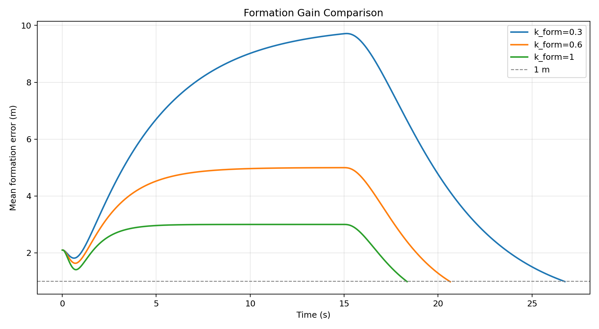
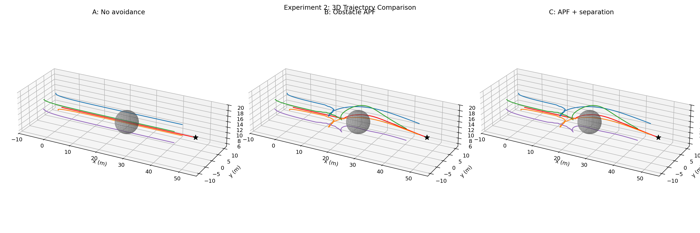
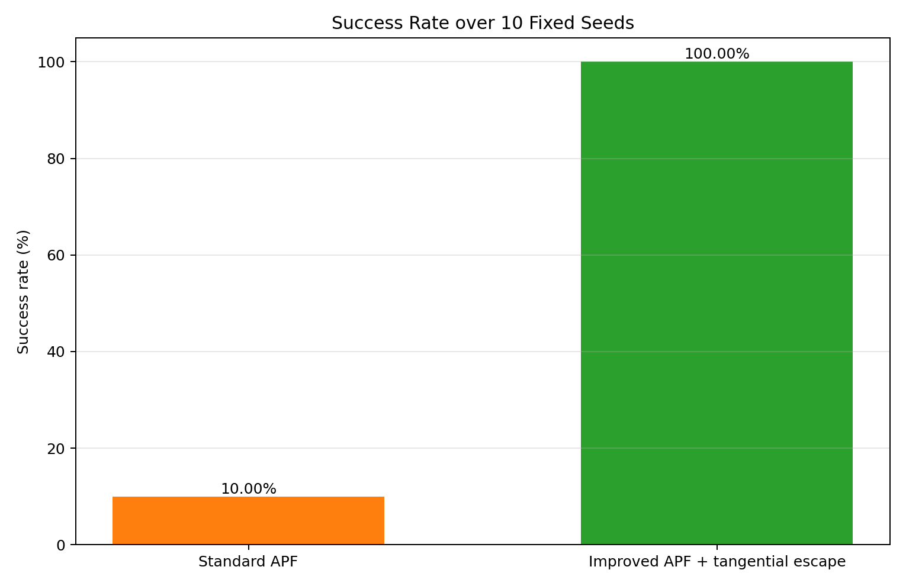
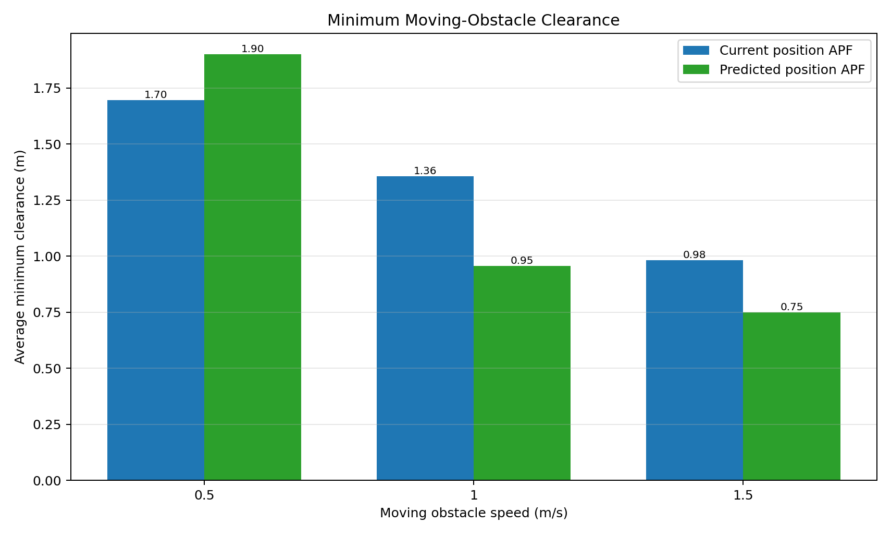

# 基于人工势场法的多无人机三维编队保持与协同避障

本项目使用 Python、NumPy 和 Matplotlib，完成 5 架无人机在三维空间中的编队形成、编队保持、静态障碍物避障、无人机间防碰撞、局部极小逃逸和移动障碍物预测避障仿真。

项目按四个递进实验组织，既可以用于课程演示，也可以作为人工势场法局限性与改进方法的对比实验。

> **模型边界说明**  
> 本项目采用的是三维一阶运动学模型，不是四旋翼飞行动力学模型。横滚角、俯仰角、偏航角、机臂和四个螺旋桨用于表现运动趋势和制作可视化动画；程序没有建立质量、惯性矩、推力、力矩、电机响应或空气动力学方程。视觉旋翼转速不会反作用于无人机的位置、速度或姿态。

## 一、四个实验的核心结论

| 实验 | 研究问题 | 主要结果 | 结论 |
|---|---|---|---|
| 实验一 | 如何形成并保持三维楔形编队 | $k_{\mathrm{form}}=0.3,0.6,1.0$ 均到达目标，最终平均编队误差均小于 1 m | 增大编队增益可以缩短完成时间并减小全过程误差，但会使姿态调整更积极 |
| 实验二 | 标准人工势场能否绕开静态球形障碍物 | 关闭避障时发生 5 次障碍物碰撞；开启 APF 后碰撞降为 0 | APF 能有效完成静态避障，但会增加绕行距离、任务时间和姿态变化 |
| 实验三 | 标准 APF 的局部极小如何改善 | 10 个种子中，标准 APF 成功率为 10%，加入切向逃逸力后为 100% | 连续多步检测加切向逃逸可以明显改善本场景中的局部极小问题 |
| 实验四 | 移动障碍物是否需要预测位置避障 | 6 个组合均无碰撞且成功率为 100%；预测法并非在所有速度下都具有更大净距离 | 固定 1 s 预测时域的收益与障碍物速度和相遇时机有关，预测参数需要与场景匹配 |

最值得向老师说明的是：项目没有预设“改进方法一定更好”。实验三确实显示切向逃逸显著提高了成功率；实验四则显示简单的固定时域预测并不会在所有指标上占优。这种结果更能体现对算法适用条件的真实分析。

## 二、系统与场景设置

### 2.1 无人机编队

系统包含 5 架无人机，其中 0 号机为领航者，1～4 号机为跟随者。相对领航者的三维楔形编队偏移为：

$$
\begin{aligned}
\boldsymbol{\delta}_0 &= \begin{bmatrix}0&0&0\end{bmatrix}^{\mathrm T}, \\
\boldsymbol{\delta}_1 &= \begin{bmatrix}-5& 3& 2\end{bmatrix}^{\mathrm T}, \\
\boldsymbol{\delta}_2 &= \begin{bmatrix}-5&-3& 2\end{bmatrix}^{\mathrm T}, \\
\boldsymbol{\delta}_3 &= \begin{bmatrix}-5& 3&-2\end{bmatrix}^{\mathrm T}, \\
\boldsymbol{\delta}_4 &= \begin{bmatrix}-5&-3&-2\end{bmatrix}^{\mathrm T}.
\end{aligned}
$$

其中，$\boldsymbol{\delta}_i$ 是第 $i$ 架无人机在领航者机体系下的期望相对位置；$\boldsymbol{\delta}_0$ 为零向量，表示 0 号领航者位于编队参考点。

领航者初始位置和目标位置分别为：

$$
\mathbf p_L(0)=\begin{bmatrix}0&0&12\end{bmatrix}^{\mathrm T}\ \mathrm m,
\qquad
\mathbf p_g=\begin{bmatrix}50&0&12\end{bmatrix}^{\mathrm T}\ \mathrm m.
$$

跟随者从各自期望编队位置附近随机初始化。所有批量对比都使用固定随机种子，并确保同一对比中的不同方法采用完全相同的初始条件。

### 2.2 一阶运动学模型

对第 $i$ 架无人机，离散时间位置更新为：

$$
\boxed{\mathbf p_i^{k+1}=\mathbf p_i^k+\mathbf v_i^k\Delta t}
$$

速度先按照速度命令进行一阶平滑：

$$
\widetilde{\mathbf v}_i^{k+1}
=(1-\alpha)\mathbf v_i^k+\alpha\mathbf v_{\mathrm{cmd},i}^k.
$$

这里，$k$ 表示离散仿真步，$\Delta t$ 为时间步长；$\mathbf p_i^k$ 和 $\mathbf v_i^k$ 分别表示当前位置和速度；$\mathbf v_{\mathrm{cmd},i}^k$ 是控制器生成的期望速度；$\alpha\in(0,1]$ 是速度平滑系数。$\widetilde{\mathbf v}_i^{k+1}$ 表示尚未限幅的平滑速度。

速度采用**整体等比例缩放**的方式限幅。设平滑后、限幅前的速度为
向量 $\widetilde{\mathbf v}_i^{k+1}$，最终使用的速度为 $\mathbf v_i^{k+1}$：

$$
\boxed{
\mathbf v_i^{k+1}=\begin{cases}
\widetilde{\mathbf v}_i^{k+1},
& \left\|\widetilde{\mathbf v}_i^{k+1}\right\|\leq v_{\max}, \\
v_{\max}\dfrac{\widetilde{\mathbf v}_i^{k+1}}
{\left\|\widetilde{\mathbf v}_i^{k+1}\right\|},
& \left\|\widetilde{\mathbf v}_i^{k+1}\right\|>v_{\max}.
\end{cases}
}
$$

直观地说：速度没有超限时保持不变；速度超限时，只把整根速度向量“缩短”到
$v_{\max}$，方向不变，而不是分别截断 $x$、$y$、$z$ 三个分量。例如：

$$
\widetilde{\mathbf v}
=\begin{bmatrix}3&4&0\end{bmatrix}^{\mathrm T}\ \mathrm{m/s},
\qquad
\left\|\widetilde{\mathbf v}\right\|=5\ \mathrm{m/s}.
$$

当 $v_{\max}=3\ \mathrm{m/s}$ 时：

$$
\mathbf v
=3\frac{\begin{bmatrix}3&4&0\end{bmatrix}^{\mathrm T}}{5}
=\begin{bmatrix}1.8&2.4&0\end{bmatrix}^{\mathrm T}\ \mathrm{m/s},
\qquad \|\mathbf v\|=3\ \mathrm{m/s}.
$$

因此，限幅后的运动方向与限幅前完全相同。

默认时间步长为 $\Delta t=0.05\ \mathrm s$，最大速度为 $v_{\max}=3.0\ \mathrm{m/s}$。编队形成、避障和逃逸全部通过生成期望速度完成，没有直接修改无人机位置。

### 2.3 编队控制

领航者使用目标吸引项：

$$
\boxed{\mathbf F_{\mathrm{goal}}
=k_{\mathrm{goal}}\left(\mathbf p_g-\mathbf p_L\right)}
$$

其中，$\mathbf p_g$ 是目标点，$\mathbf p_L$ 是领航者当前位置，$k_{\mathrm{goal}}>0$ 是目标吸引增益。该项的方向始终由领航者指向目标点。

领航者的水平航向角由当前速度计算：

$$
\psi_L=\begin{cases}
\operatorname{atan2}(v_{L,y},v_{L,x}),
& \sqrt{v_{L,x}^2+v_{L,y}^2}>\varepsilon_v,\\
\psi_{L,\mathrm{last}},
& \sqrt{v_{L,x}^2+v_{L,y}^2}\leq\varepsilon_v.
\end{cases}
$$

水平速度过小时保留上一个有效航向 $\psi_{L,\mathrm{last}}$，避免航向被突然重置为零。绕世界 $z$ 轴的旋转矩阵为：

$$
\mathbf R_z(\psi)=
\begin{bmatrix}
\cos\psi&-\sin\psi&0\\
\sin\psi& \cos\psi&0\\
0&0&1
\end{bmatrix}.
$$

跟随者的期望位置由领航者航向和编队偏移共同确定：

$$
\boxed{\mathbf p_{i,\mathrm{des}}
=\mathbf p_L+\mathbf R_z(\psi_L)\boldsymbol{\delta}_i},
\qquad i=1,2,3,4.
$$

该式先将固定楔形偏移 $\boldsymbol{\delta}_i$ 按领航者航向旋转，再平移到领航者当前位置，因此整个编队会随领航者转向。

其编队控制由位置误差和速度匹配组成：

$$
\mathbf F_{\mathrm{form},i}
=k_{\mathrm{form}}\left(\mathbf p_{i,\mathrm{des}}-\mathbf p_i\right),
$$

$$
\mathbf F_{\mathrm{vel},i}
=k_{\mathrm{vel}}\left(\mathbf v_L-\mathbf v_i\right).
$$

其中，$\mathbf F_{\mathrm{form},i}$ 用于消除位置编队误差，$\mathbf F_{\mathrm{vel},i}$ 用于让跟随者速度趋近领航者速度。在无障碍实验中：

$$
\mathbf v_{\mathrm{cmd},L}=\mathbf F_{\mathrm{goal}},
\qquad
\mathbf v_{\mathrm{cmd},i}
=\mathbf F_{\mathrm{form},i}+\mathbf F_{\mathrm{vel},i}.
$$

以上速度命令在使用前仍需经过前述向量模长限幅。

当领航者水平速度接近零时，系统保留上一个有效航向角，避免编队方向突然重置。

### 2.4 姿态与旋翼可视化

程序首先根据速度命令与当前速度之差，构造仅用于显示的近似期望加速度：

$$
\boxed{\mathbf a_{\mathrm{des},i}
=\frac{\mathbf v_{\mathrm{cmd},i}-\mathbf v_i}{\tau_v}}
$$

其中，$\tau_v$ 是速度响应显示时间常数。该加速度不是由质量和推力方程计算得到的真实加速度。

期望偏航角优先采用当前平滑速度的水平方向：

$$
\psi_{\mathrm{des},i}=\begin{cases}
\operatorname{atan2}(v_{i,y},v_{i,x}),
& \sqrt{v_{i,x}^2+v_{i,y}^2}>\varepsilon_v,\\
\psi_{i,\mathrm{last}},
& \sqrt{v_{i,x}^2+v_{i,y}^2}\leq\varepsilon_v.
\end{cases}
$$

为了根据无人机自身朝向解释水平加速度，将期望加速度旋转到机体坐标系：

$$
\mathbf a_{b,i}=\mathbf R_z(-\psi_{\mathrm{des},i})\mathbf a_{\mathrm{des},i}
=\begin{bmatrix}a_{b,x}&a_{b,y}&a_{b,z}\end{bmatrix}^{\mathrm T}.
$$

期望俯仰角 $\theta_{\mathrm{des}}$ 和期望横滚角 $\phi_{\mathrm{des}}$ 为：

$$
\boxed{
\theta_{\mathrm{des}}
=\operatorname{clip}\!\left(\frac{a_{b,x}}{g},-\theta_{\max},\theta_{\max}\right)
}
$$

$$
\boxed{
\phi_{\mathrm{des}}
=\operatorname{clip}\!\left(-\frac{a_{b,y}}{g},-\phi_{\max},\phi_{\max}\right)
}
$$

这里，$g=9.81\ \mathrm{m/s^2}$；$\operatorname{clip}(x,a,b)$ 表示把 $x$ 限制在区间 $[a,b]$；$\phi_{\max}=\theta_{\max}=25^\circ$。正向机体加速度表现为俯仰，横向机体加速度表现为横滚。

姿态采用一阶平滑跟随：

$$
\begin{aligned}
\phi_i^{k+1}
&=\phi_i^k+\beta_{rp}\left(\phi_{\mathrm{des},i}-\phi_i^k\right),\\
\theta_i^{k+1}
&=\theta_i^k+\beta_{rp}\left(\theta_{\mathrm{des},i}-\theta_i^k\right),\\
\psi_i^{k+1}
&=\psi_i^k+\beta_{\mathrm{yaw}}
\operatorname{wrapToPi}\!\left(\psi_{\mathrm{des},i}-\psi_i^k\right).
\end{aligned}
$$

角度环绕函数定义为：

$$
\boxed{
\operatorname{wrapToPi}(\gamma)
=\left((\gamma+\pi)\bmod 2\pi\right)-\pi
}
$$

它把偏航误差限制在 $[-\pi,\pi)$，使无人机始终沿较短方向转动。例如，当前偏航为 $179^\circ$、期望偏航为 $-179^\circ$ 时，实际误差会被处理为 $2^\circ$，而不是 $-358^\circ$。

视觉旋翼的基础转速为：

$$
\omega_{\mathrm{base}}
=\omega_{\mathrm{hover}}+k_{\omega z}v_{\mathrm{cmd},z}.
$$

令横滚和俯仰显示误差分别为
$e_\phi=\phi_{\mathrm{des}}-\phi$、
$e_\theta=\theta_{\mathrm{des}}-\theta$。四个 X 形机臂按照“前左、后左、后右、前右”排列，其视觉混控向量为：

$$
\mathbf m_\phi=\begin{bmatrix}-1&-1&1&1\end{bmatrix}^{\mathrm T},
\qquad
\mathbf m_\theta=\begin{bmatrix}-1&1&1&-1\end{bmatrix}^{\mathrm T}.
$$

四个旋翼的视觉转速为：

$$
\boldsymbol\omega
=\operatorname{clip}\!\left[
\omega_{\mathrm{base}}\mathbf 1_4
+k_{\mathrm{vis}}\left(e_\phi\mathbf m_\phi+e_\theta\mathbf m_\theta\right),
\omega_{\min},\omega_{\max}
\right].
$$

相邻旋翼使用相反旋转方向：

$$
\mathbf s=\begin{bmatrix}1&-1&1&-1\end{bmatrix}^{\mathrm T}.
$$

第 $j$ 个旋翼的动画相位更新为：

$$
\boxed{
q_j^{k+1}=\left(q_j^k+s_j\omega_j^k\Delta t\right)\bmod 2\pi
}
$$

对 $2\pi$ 取模可以防止相位数值无限增大。上述旋翼混控只服务于动画效果，不产生推力，也不参与无人机的位置、速度或姿态更新。

绘制机体时，局部坐标点 $\mathbf r_b$ 通过欧拉角旋转到世界坐标系：

$$
\boxed{
\mathbf r_w=\mathbf p_i+mathbf R\mathbf r_b,
\qquad
\mathbf R=\mathbf R_z(\psi)\mathbf R_y(\theta)\mathbf R_x(\phi)
}
$$

其中：

$$
\mathbf R_x(\phi)=
\begin{bmatrix}
1&0&0\\
0&\cos\phi&-\sin\phi\\
0&\sin\phi&\cos\phi
\end{bmatrix},
$$

$$
\mathbf R_y(\theta)=
\begin{bmatrix}
\cos\theta&0&\sin\theta\\
0&1&0\\
-\sin\theta&0&\cos\theta
\end{bmatrix},
$$

$$
\mathbf R_z(\psi)=
\begin{bmatrix}
\cos\psi&-\sin\psi&0\\
\sin\psi&\cos\psi&0\\
0&0&1
\end{bmatrix}.
$$

$\phi$、$\theta$、$\psi$ 分别是横滚角、俯仰角和偏航角。该旋转只用于把机臂和旋翼从机体局部坐标变换到世界坐标，从而在动画中显示机体倾斜。

## 三、算法设计

### 3.1 静态障碍物人工势场

设第 $i$ 架无人机位置为 $\mathbf p_i$，第 $j$ 个球形障碍物中心为 $\mathbf c_j$、半径为 $r_j$，无人机等效半径为 $r_u$。无人机中心到障碍物中心的距离为：

$$
d_{ij}=\left\|\mathbf p_i-\mathbf c_j\right\|.
$$

无人机外表面到障碍物外表面的净距离为：

$$
\boxed{\rho_{ij}=d_{ij}-r_j-r_u}
$$

因此，$\rho_{ij}>0$ 表示二者仍有间隙，$\rho_{ij}=0$ 表示刚好接触，$\rho_{ij}<0$ 表示发生几何重叠。背离障碍物的径向单位向量为：

$$
\mathbf n_{ij}
=\frac{\mathbf p_i-\mathbf c_j}
{\max\!\left(d_{ij},\varepsilon\right)}.
$$

当无人机位于影响距离 $\rho_{0,j}$ 内时，障碍物排斥速度分量为：

$$
\boxed{
\mathbf F_{\mathrm{obs},ij}=\begin{cases}
k_{\mathrm{obs}}
\left(\dfrac{1}{\rho_{ij}^{\ast}}-\dfrac{1}{\rho_{0,j}}\right)
\dfrac{1}{\left(\rho_{ij}^{\ast}\right)^2}\mathbf n_{ij},
& \rho_{ij}<\rho_{0,j},\\[6pt]
\mathbf 0_{3\times1},
& \rho_{ij}\geq\rho_{0,j},
\end{cases}
}
$$

其中：

$$
\rho_{ij}^{\ast}=\max(\rho_{ij},\varepsilon).
$$

$k_{\mathrm{obs}}>0$ 是障碍物排斥增益，$\varepsilon>0$ 是防止除零的最小距离。由于 $\mathbf n_{ij}$ 从障碍物中心指向无人机，所以排斥方向一定背离障碍物。对于多个障碍物，先求和再进行合力模长限幅：

$$
\mathbf F_{\mathrm{obs},i}
=\operatorname{limitNorm}\!\left(
\sum_j\mathbf F_{\mathrm{obs},ij},
F_{\mathrm{obs},\max}
\right).
$$

若无人机恰好位于障碍物球心，径向方向无法由几何关系定义，代码会根据无人机和障碍物编号生成确定性单位向量，避免随机性、除零和 NaN。

### 3.2 无人机间防碰撞

第 $i$、$j$ 架无人机之间的中心距离和从 $j$ 指向 $i$ 的单位向量为：

$$
d_{ij}=\left\|\mathbf p_i-\mathbf p_j\right\|,
\qquad
\mathbf n_{ij}=\frac{\mathbf p_i-\mathbf p_j}{\max(d_{ij},\varepsilon)}.
$$

当 $d_{ij}$ 小于安全距离 $d_{\mathrm{safe}}$ 时，施加机间排斥项：

$$
\boxed{
\mathbf F_{\mathrm{sep},ij}=\begin{cases}
k_{\mathrm{sep}}
\left(\dfrac{1}{d_{ij}^{\ast}}-\dfrac{1}{d_{\mathrm{safe}}}\right)
\dfrac{1}{(d_{ij}^{\ast})^2}\mathbf n_{ij},
& d_{ij}<d_{\mathrm{safe}},\\[6pt]
\mathbf 0_{3\times1},
& d_{ij}\geq d_{\mathrm{safe}},
\end{cases}
}
$$

其中 $d_{ij}^{\ast}=\max(d_{ij},\varepsilon)$。同一无人机对只计算一次，并按照
$\mathbf F_{\mathrm{sep},ji}=-\mathbf F_{\mathrm{sep},ij}$
施加大小相等、方向相反的分离项。若两机位置完全重合，则依据无人机编号生成确定性分离方向，不使用随机方向，因此不会产生 NaN，结果保持可复现。

每架无人机收到的总分离项为：

$$
\mathbf F_{\mathrm{sep},i}
=\operatorname{limitNorm}\!\left(
\sum_{j\ne i}\mathbf F_{\mathrm{sep},ij},
F_{\mathrm{sep},\max}
\right).
$$

加入避障后的完整速度命令为：

$$
\boxed{
\mathbf v_{\mathrm{cmd},L}
=\mathbf F_{\mathrm{goal},L}
+\mathbf F_{\mathrm{obs},L}
+\mathbf F_{\mathrm{sep},L}
}
$$

$$
\boxed{
\mathbf v_{\mathrm{cmd},i}
=\mathbf F_{\mathrm{form},i}
+\mathbf F_{\mathrm{vel},i}
+\mathbf F_{\mathrm{obs},i}
+\mathbf F_{\mathrm{sep},i},
\quad i=1,2,3,4
}
$$

所有控制分量相加后，仍按 $v_{\max}$ 对速度命令整体限幅，再进入速度平滑环节。

实验二将机间排斥触发距离设为 $d_{\mathrm{safe}}=4.0\ \mathrm m$。原因是楔形编队自然最小间距约为 $2.95\ \mathrm m$，若沿用建议值 $2.0\ \mathrm m$，正常实验中机间排斥几乎不会触发，无法观察对比效果。实际碰撞判据仍为两机距离小于 $2r_u=0.6\ \mathrm m$。

障碍物碰撞与机间碰撞的几何判据分别为：

$$
\left\|\mathbf p_i-\mathbf c_j\right\|<r_j+r_u,
$$

$$
\left\|\mathbf p_i-\mathbf p_j\right\|<2r_u.
$$

同一次连续接触只计数一次，并且无人机对 $(i,j)$ 与 $(j,i)$ 被视为同一对。

### 3.3 局部极小检测与切向逃逸

实验三为每架无人机保存最近 20 步的速度和任务距离。只有以下条件连续满足若干步，才判定可能进入局部极小：

1. 任务距离 $D_i^k>2\ \mathrm m$；
2. 当前速度 $\|\mathbf v_i^k\|<0.15\ \mathrm{m/s}$；
3. 附近存在处于影响范围内的障碍物；
4. 最近 20 步的距离改善量满足 $D_i^{k-19}-D_i^k<0.05\ \mathrm m$。

其中，领航者的任务距离为：

$$
D_L^k=\left\|\mathbf p_g-\mathbf p_L^k\right\|,
$$

跟随者的任务距离为：

$$
D_i^k=\left\|\mathbf p_{i,\mathrm{des}}^k-\mathbf p_i^k\right\|.
$$

“改善量”比较的是长度为 20 的历史窗口首尾距离，而不是只观察单步速度；四项条件还必须连续满足设定步数才会触发逃逸。

进入逃逸状态后，程序在最近障碍物的径向方向上构造单位切向量：

$$
\mathbf n_i
=\frac{\mathbf p_i-\mathbf c_{\mathrm{near}}}
{\left\|\mathbf p_i-\mathbf c_{\mathrm{near}}\right\|},
$$

$$
\widetilde{\mathbf t}_i
=\mathbf n_i\times\begin{bmatrix}0&0&1\end{bmatrix}^{\mathrm T},
\qquad
\mathbf t_i
=\frac{\widetilde{\mathbf t}_i}{\left\|\widetilde{\mathbf t}_i\right\|},
$$

$$
\boxed{\mathbf F_{\mathrm{escape},i}=k_{\mathrm{escape}}\mathbf t_i}
$$

由于 $\|\mathbf t_i\|=1$，逃逸力模长为 $k_{\mathrm{escape}}$。叉乘保证 $\mathbf t_i\perp\mathbf n_i$，因此逃逸项沿障碍物切向推动无人机，而不是继续与径向排斥力对抗。

当 $\|\widetilde{\mathbf t}_i\|$ 过小时，改用 $\mathbf n_i\times[1,0,0]^{\mathrm T}$ 构造切向量。绕行符号由无人机编号和领航者方向确定，保证编队成员不会随机选择相反方向。改进方法只是在原速度命令中加入：

$$
\mathbf v_{\mathrm{cmd},i}^{\mathrm{improved}}
=\mathbf v_{\mathrm{cmd},i}^{\mathrm{standard}}
+\mathbf F_{\mathrm{escape},i}.
$$

非逃逸状态下定义 $\mathbf F_{\mathrm{escape},i}=\mathbf 0$，因此此时改进方法不会额外改变速度命令；关闭改进功能时，逃逸项始终为零。

逃逸仍然只改变期望速度，姿态继续经过原有平滑模型更新。

为稳定复现多障碍物下的局部极小，实验三使用 $k_{\mathrm{obs}}=20.0$、$F_{\mathrm{obs},\max}=8.0$ 和零初始速度。最终参数均写在 `config.py` 中，程序不会根据实验结果临时改变参数。

### 3.4 移动障碍物预测避障

移动球形障碍物按真实速度更新：

$$
\boxed{
\mathbf c_j^{k+1}=\mathbf c_j^k+\mathbf v_{o,j}\Delta t
}
$$

其中，$\mathbf c_j^k$ 是第 $j$ 个移动障碍物的真实中心，$\mathbf v_{o,j}$ 是其恒定速度。控制器使用的障碍物中心为：

$$
\boxed{
\widehat{\mathbf c}_j^k=\begin{cases}
\mathbf c_j^k,
& \text{当前位置方法},\\
\mathbf c_j^k+T_p\mathbf v_{o,j},
& \text{预测位置方法}.
\end{cases}
}
$$

其中，$T_p=1.0\ \mathrm s$ 是预测时域。人工势场公式中的障碍物中心 $\mathbf c_j$ 会被替换为控制中心 $\widehat{\mathbf c}_j^k$，但它只参与排斥速度计算，不会写回真实障碍物状态。

碰撞检测始终使用真实中心 $\mathbf c_j^{k+1}$：

$$
\left\|\mathbf p_i^{k+1}-\mathbf c_j^{k+1}\right\|<r_j+r_u.
$$

因此，预测功能只能改变无人机控制反应，不能修改移动障碍物的真实运动轨迹或碰撞判定位置。

### 3.5 评价指标计算

设某项指标的有效评价区间包含 $N+1$ 个时刻（$k=0,1,\ldots,N$），共有 $n_f=4$ 架跟随者和 $n_u=5$ 架无人机。实验四可能在任务完成后继续记录一段恢复过程；其任务误差和航程统计在完成时刻截断，而安全距离和恢复时间仍使用相应的完整记录区间。

第 $i$ 架跟随者在第 $k$ 步的编队误差为：

$$
e_i^k=\left\|\mathbf p_i^k-\mathbf p_{i,\mathrm{des}}^k\right\|,
\qquad i=1,2,3,4.
$$

该时刻的平均编队误差为：

$$
\bar e^k=\frac{1}{n_f}\sum_{i=1}^{n_f}e_i^k.
$$

全过程平均误差、最大误差和最终平均误差分别为：

$$
e_{\mathrm{mean}}
=\frac{1}{(N+1)n_f}\sum_{k=0}^{N}\sum_{i=1}^{n_f}e_i^k,
$$

$$
e_{\max}=\max_{\substack{0\leq k\leq N\\1\leq i\leq n_f}}e_i^k,
\qquad
e_{\mathrm{final}}=\bar e^N.
$$

第 $i$ 架无人机的飞行距离以及集群总飞行距离为：

$$
L_i=\sum_{k=1}^{N}\left\|\mathbf p_i^k-\mathbf p_i^{k-1}\right\|,
\qquad
L_{\mathrm{total}}=\sum_{i=0}^{n_u-1}L_i.
$$

全过程最小障碍物表面净距离为：

$$
\rho_{\min}
=\min_{k,i,j}
\left(
\left\|\mathbf p_i^k-\mathbf c_j^k\right\|-r_j-r_u
\right).
$$

全过程最小机间距离为：

$$
d_{\min}
=\min_{k,\,i<j}\left\|\mathbf p_i^k-\mathbf p_j^k\right\|.
$$

姿态变化均方根使用横滚、俯仰、偏航三个角速度样本共同计算。令
$\boldsymbol\eta_i^k=[\phi_i^k,\theta_i^k,\psi_i^k]^{\mathrm T}$，则：

$$
\mathrm{RMS}_{\mathrm{att}}
=\frac{180}{\pi}
\sqrt{
\frac{1}{3n_uN}
\sum_{k=1}^{N}\sum_{i=0}^{n_u-1}
\left\|
\frac{\boldsymbol\eta_i^k-\boldsymbol\eta_i^{k-1}}{\Delta t}
\right\|^2
}.
$$

其单位为 $^\circ/\mathrm s$。领航者到达目标且编队完成的判断为：

$$
\left\|\mathbf p_L^k-\mathbf p_g\right\|\leq1\ \mathrm m,
\qquad
\bar e^k<1\ \mathrm m.
$$

实验三和实验四的单次运行成功条件进一步要求：

$$
\boxed{
\mathrm{success}
=\mathrm{completed}
\land(N_{\mathrm{obs}}=0)
\land(N_{\mathrm{uav}}=0)
\land(e_{\mathrm{final}}<1\ \mathrm m)
}
$$

其中，$N_{\mathrm{obs}}$ 和 $N_{\mathrm{uav}}$ 分别是经连续接触去重后的障碍物碰撞次数和无人机碰撞次数。

实验四的编队恢复时间从动态障碍物影响阶段结束时刻 $t_{\mathrm{end}}$ 开始计算。设
$H=\lceil2/\Delta t\rceil$，第一个满足下式的时刻 $t_k$ 为恢复确认时刻：

$$
\bar e^{k-H+1},\bar e^{k-H+2},\ldots,\bar e^k<0.8\ \mathrm m.
$$

于是：

$$
t_{\mathrm{recovery}}=t_k-t_{\mathrm{end}}.
$$

若仿真结束仍找不到满足条件的 $t_k$，则恢复时间记为 `NaN`。

## 四、实验结果与分析

### 4.1 实验一：无障碍三维编队形成与保持

| $k_{\mathrm{form}}$ | 到达目标 | 完成时间/s | 全过程平均编队误差/m | 最大误差/m | 最终误差/m | 集群总航程/m | 最大横滚角/° | 最大俯仰角/° |
|---:|:---:|---:|---:|---:|---:|---:|---:|---:|
| 0.3 | 是 | 26.75 | 6.055 | 9.737 | 0.991 | 244.358 | 1.882 | 11.184 |
| 0.6 | 是 | 20.65 | 3.947 | 4.998 | 0.985 | 244.577 | 3.127 | 11.184 |
| 1.0 | 是 | 18.35 | 2.662 | 3.000 | 0.990 | 242.908 | 5.009 | 11.184 |

结果表明，三组参数均满足领航者到达目标、最终平均编队误差小于 1 m、速度不超过 $3\ \mathrm{m/s}$ 和姿态不越界等要求。随着 $k_{\mathrm{form}}$ 增大，跟随者更快修正初始偏差，任务完成时间和全过程误差下降，但最大横滚角与姿态变化程度增大。

全过程平均误差明显高于最终误差，是因为统计包含了初始随机偏差和编队形成阶段；它不能被解释为稳态误差。



### 4.2 实验二：静态障碍物避障与机间防碰撞

| 方法 | 成功 | 完成时间/s | 平均编队误差/m | 最大编队误差/m | 最小障碍物净距离/m | 最小机间距离/m | 障碍物碰撞次数 | 总航程/m |
|---|:---:|---:|---:|---:|---:|---:|---:|---:|
| A：无避障 | 否 | 20.65 | 3.958 | 9.314 | -4.250 | 4.000 | 5 | 244.475 |
| B：仅障碍物 APF | 是 | 37.65 | 3.723 | 15.638 | 1.049 | 2.948 | 0 | 304.190 |
| C：APF + 机间防碰撞 | 是 | 37.60 | 3.727 | 15.638 | 1.049 | 2.973 | 0 | 304.150 |

无避障时，轨迹虽然仍能到达目标并恢复编队，但穿过障碍物，碰撞检测正确记录了 5 架无人机的连续接触事件。开启 APF 后，障碍物碰撞次数降为 0，最小表面净距离约为 $1.05\ \mathrm m$。

加入机间防碰撞后，最小机间距离由 $2.948\ \mathrm m$ 提高到 $2.973\ \mathrm m$。提升幅度不大，是因为该初始编队本身没有接近实际碰撞阈值；它说明分离项在工作，但不应把这组结果夸大为显著提升。

绕障使最大编队误差和总航程上升，这是安全性与队形紧凑性之间的正常权衡。



### 4.3 实验三：局部极小与切向逃逸

每种方法使用同一组 10 个固定随机种子，单次失败或达到最大时间不会中断批量实验。

| 方法 | 成功率 | 成功样本平均完成时间/s | 平均总航程/m | 平均编队误差/m | 最大编队误差/m | 最小障碍物净距离/m | 局部极小检测次数 | 逃逸启用次数 | 碰撞次数 |
|---|---:|---:|---:|---:|---:|---:|---:|---:|---:|
| 标准 APF | 10% | 55.05 | 120.677 | 0.683 | 14.965 | 1.550 | 10 | 0 | 0 |
| APF + 切向逃逸 | 100% | 46.05 | 433.403 | 4.799 | 14.965 | 1.549 | 48 | 48 | 0 |

标准 APF 在对称多障碍物场景中容易出现吸引项与排斥项平衡，10 次运行只有 1 次成功。加入切向逃逸后，10 次全部在最大时间内到达目标且没有发生碰撞。

需要注意，标准 APF 的平均航程和平均编队误差看起来更小，并不代表其效果更好：9 个失败样本较早停滞，因而累计飞行距离和后续编队运动都更少。比较算法时必须同时查看成功率，不能孤立地看航程或平均误差。

代表性随机种子 $\mathrm{seed}=42$ 中，标准方法运行至 $100\ \mathrm s$ 仍未完成；改进方法在 $43.55\ \mathrm s$ 完成，并触发 4 次局部极小检测和 4 次切向逃逸。



### 4.4 实验四：移动障碍物当前位置与预测位置避障

移动障碍物从 $[25,-12,12]^{\mathrm T}\ \mathrm m$ 出发，沿 $y$ 轴正方向横穿集群路径。分别测试 $0.5\ \mathrm{m/s}$、$1.0\ \mathrm{m/s}$ 和 $1.5\ \mathrm{m/s}$；每种速度和方法组合使用相同的 5 个固定随机种子。

| 障碍物速度/(m/s) | 方法 | 成功率 | 平均完成时间/s | 平均最小净距离/m | 平均最大编队误差/m | 平均恢复时间/s | 平均总航程/m | 碰撞次数 |
|---:|---|---:|---:|---:|---:|---:|---:|---:|
| 0.5 | 当前位置 | 100% | 20.65 | 1.696 | 5.304 | 8.60 | 246.469 | 0 |
| 0.5 | 预测位置 | 100% | 20.70 | 1.899 | 5.593 | 8.55 | 246.770 | 0 |
| 1.0 | 当前位置 | 100% | 20.95 | 1.356 | 6.541 | 8.65 | 247.846 | 0 |
| 1.0 | 预测位置 | 100% | 21.20 | 0.955 | 8.935 | 8.70 | 250.050 | 0 |
| 1.5 | 当前位置 | 100% | 23.00 | 0.983 | 14.921 | 10.70 | 253.012 | 0 |
| 1.5 | 预测位置 | 100% | 21.65 | 0.749 | 12.467 | 10.10 | 248.783 | 0 |

六组测试全部成功且没有碰撞。固定 1 s 预测时域的表现随移动速度变化：

- 在 $0.5\ \mathrm{m/s}$ 时，预测法将平均最小净距离从 $1.696\ \mathrm m$ 提高到 $1.899\ \mathrm m$；
- 在 $1.0\ \mathrm{m/s}$ 时，预测位置使无人机更早响应，但本场景中的后续交汇几何关系令实际最小净距离反而减小；
- 在 $1.5\ \mathrm{m/s}$ 时，预测法虽然没有取得更大的最小净距离，却缩短了完成时间和编队恢复时间，并降低了最大编队误差、总航程和姿态变化。

因此，本实验支持的结论是“预测可能改善动态避障的提前性和恢复过程”，而不是“预测一定在所有指标上优于当前位置方法”。固定预测时域存在速度依赖，后续可研究自适应预测时间或基于相对速度的碰撞时间预测。

编队恢复时间的数学定义见 3.5 节：避开移动障碍物后，平均编队误差重新小于 $0.8\ \mathrm m$，并连续保持 $2\ \mathrm s$。若到仿真结束仍不满足，CSV 中保存为 `NaN`，汇总中另行统计未恢复次数。本次 30 个批量样本均完成恢复。



## 五、项目目录

```text
uav_swarm_3d/
├── main.py                         # 实验一入口
├── config.py                       # 公共参数及四个实验配置
├── models.py                       # 无人机和静态球形障碍物数据模型
├── controller.py                   # 编队、姿态及静态 APF 控制
├── simulator.py                    # 实验一仿真与指标统计
├── visualization.py                # 实验一绘图与四旋翼动画
├── experiment2.py                  # 实验二入口
├── experiment2_simulator.py        # 静态避障、机间避碰和碰撞检测
├── experiment2_visualization.py    # 实验二图表与动画
├── experiment3.py                  # 实验三单次/批量入口
├── experiment3_simulator.py        # 局部极小检测与切向逃逸仿真
├── experiment3_visualization.py    # 实验三统计图
├── experiment4.py                  # 实验四单次/批量入口
├── experiment4_models.py           # MovingSphereObstacle 数据模型
├── experiment4_simulator.py        # 移动障碍物与预测避障仿真
├── experiment4_visualization.py    # 实验四图表与动画
├── requirements.txt
├── README.md
└── results/
    ├── experiment_1/
    ├── experiment_2/
    ├── experiment_3/
    └── experiment_4/
```

## 六、安装与运行

### 6.1 环境要求

- Python 3.10 或更高版本；
- NumPy；
- Matplotlib；
- Pillow，用于保存 GIF。

在项目根目录执行：

```bash
python -m pip install -r requirements.txt
```

建议先确认 Python 版本：

```bash
python --version
```

### 6.2 实验一

运行完整实验并生成代表性 GIF：

```bash
python main.py
```

只生成数值结果和静态图：

```bash
python main.py --skip-animation
```

结果目录：`results/experiment_1/`

### 6.3 实验二

```bash
python experiment2.py
```

跳过 GIF：

```bash
python experiment2.py --skip-animation
```

结果目录：`results/experiment_2/`

### 6.4 实验三

运行 10 个固定种子的批量对比：

```bash
python experiment3.py --mode batch
```

运行代表性改进方法并播放动画：

```bash
python experiment3.py --mode single --method improved_apf --seed 42 --animate
```

运行标准方法单次实验：

```bash
python experiment3.py --mode single --method standard_apf --seed 42
```

结果目录：`results/experiment_3/`  
原始数据：`all_runs.csv`  
汇总数据：`summary.csv`

### 6.5 实验四

运行 3 种速度 × 2 种方法 × 5 个种子的批量实验：

```bash
python experiment4.py --mode batch
```

运行代表性预测避障场景并保存 GIF：

```bash
python experiment4.py --mode single --method predicted_position --obstacle-speed 1.0 --seed 42 --animate
```

运行当前位置避障单次场景：

```bash
python experiment4.py --mode single --method current_position --obstacle-speed 1.0 --seed 42
```

结果目录：`results/experiment_4/`  
原始数据：`all_runs.csv`  
汇总数据：`summary.csv`

## 七、结果文件说明

### 实验一

- `metrics.csv`：三组编队增益的完整评价指标；
- `formation_error_comparison.png`：编队误差对比；
- `k_form_*/`：各增益的三维轨迹、姿态、旋翼转速和动画。

### 实验二

- `metrics.csv`：三种避障方法的指标；
- `trajectory_comparison_3d.png`：三维轨迹对比；
- `obstacle_clearance_comparison.png`：障碍物净距离；
- `inter_uav_distance_comparison.png`：最小机间距离；
- `result_comparison_table.png`：结果对比表；
- `avoidance_animation_method_C.gif`：APF 与机间避碰动画。

### 实验三

- `all_runs.csv`：20 次单次运行记录；
- `summary.csv`：两种方法的汇总统计；
- `trajectory_standard_apf.png`、`trajectory_improved_apf.png`：代表性轨迹；
- `success_rate.png`：成功率柱状图；
- `average_completion_time.png`、`average_flight_distance.png`：时间与航程对比；
- `formation_error_comparison.png`：编队误差对比。

### 实验四

- `all_runs.csv`：30 次批量运行记录；
- `summary.csv`：6 个方法/速度组合的汇总；
- `trajectory_current_position.png`、`trajectory_predicted_position.png`：代表性轨迹；
- `success_rate_by_speed.png`：不同速度下的成功率；
- `minimum_clearance_comparison.png`：最小净距离；
- `maximum_formation_error_comparison.png`：最大编队误差；
- `formation_recovery_time_comparison.png`：恢复时间；
- `single_predicted_position_speed_1_seed_42/dynamic_obstacle_animation.gif`：代表性动态场景动画。

## 八、正确性与可复现性检查

项目实现并检查了以下条件：

- 所有速度均按向量模长限幅，不分别截断三个坐标分量；
- 横滚角、俯仰角不超过 ±25°；
- 偏航误差经过角度环绕处理，无 ±π 跨界大跳变；
- 距离计算具有 epsilon 保护，状态中不出现 NaN 或 Inf；
- 碰撞采用连续接触去重，同一对无人机的 $(i,j)$ 与 $(j,i)$ 视为同一事件；
- 移动障碍物碰撞检测使用真实位置，而不是预测位置；
- 每次批量运行都重新创建无人机和障碍物；
- 同组方法使用相同随机种子和初始条件；
- 批量实验不显示动画，单次失败不会中断后续实验；
- 关闭逃逸功能时，标准 APF 不会产生逃逸力；
- 关闭姿态与旋翼绘制不会改变无人机轨迹；
- 四个旋翼相邻方向相反，相位按时间连续更新并对 $2\pi$ 取模；
- 结果目录由程序自动创建，不要求手动建立。

## 九、向老师汇报时的建议顺序

1. 先说明模型边界：这是运动学与控制算法仿真，姿态和旋翼是平滑可视化，不是飞行动力学；
2. 用实验一说明编队能够形成，并展示编队增益带来的响应速度与姿态变化权衡；
3. 用实验二的无避障碰撞和 APF 零碰撞轨迹说明静态避障有效；
4. 用实验三的 $10\%\rightarrow100\%$ 成功率突出标准 APF 的局部极小问题及切向逃逸的作用；
5. 用实验四说明预测控制的效果依赖预测时域和障碍物速度，体现对实验结果的客观分析；
6. 最后播放实验二或实验四 GIF，说明机体倾斜和旋翼转动只是对控制结果的直观表达，不参与轨迹计算。

## 十、局限性与后续工作

当前项目重点是人工势场和编队控制的算法验证，主要局限包括：

- 没有建立真实四旋翼动力学，不能直接用于飞控器参数设计；
- APF 参数与障碍物尺度、速度和编队大小有关，跨场景时需要重新评估；
- 固定 1 s 预测只是一阶线性外推，不适合突然变速或转向的障碍物；
- 编队整体绕障仍可能出现队形拉伸，安全性和编队紧凑性之间存在权衡；
- 实验次数适合课程展示，但若用于统计性研究，应增加种子数量并给出置信区间。

可继续研究自适应预测时域、基于碰撞时间的动态障碍物风险评估、领航者路径规划、编队重构，以及在保持当前上层控制算法的基础上接入更高保真的动力学模型。
